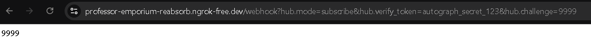
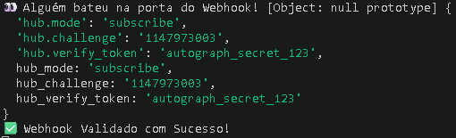
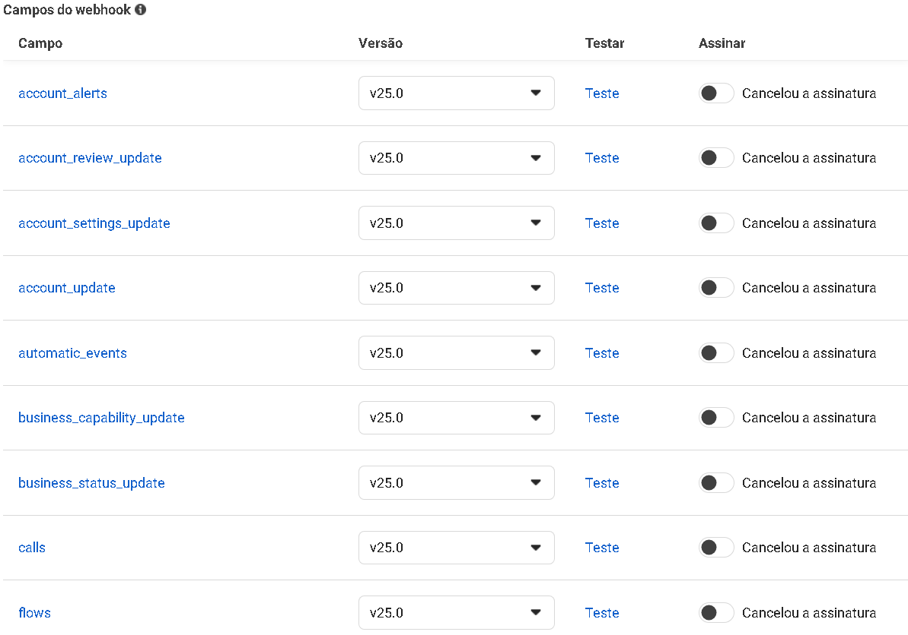

# Relatório Técnico: Card #5 - Configuração e Validação do Webhook (Meta/WhatsApp)

**Status:** Concluído ✅  
**Objetivo:** Criar e validar a rota de recebimento (webhook) da API do WhatsApp Cloud no painel Meta for Developers, garantindo a autenticação segura através de Token de Verificação.

---

## 1. Variáveis de Ambiente (.env)
Foi configurada a chave de segurança para garantir que apenas a Meta consiga validar o webhook.
* `WEBHOOK_VERIFY_TOKEN=autograph_secret_123` *(Nota: O valor real em produção deve ser um hash seguro).*

## 2. Implementação do Backend (Node.js + Express)

A lógica de validação foi centralizada em um Controller dedicado, verificando a compatibilidade entre o token enviado pela Meta e o token salvo no ambiente local.

**Arquivo: `src/controllers/webhook.controller.ts`**
```typescript
import { Request, Response } from 'express';

export class WebhookController {
  public static validate(req: Request, res: Response) {
    console.log('👀 Alguém bateu na porta do Webhook!', req.query);

    const mode = req.query['hub.mode'];
    const token = req.query['hub.verify_token'];
    const challenge = req.query['hub.challenge'];

    // Validação de segurança
    if (mode === 'subscribe' && token === process.env.WEBHOOK_VERIFY_TOKEN) {
      console.log('✅ Webhook Validado com Sucesso!');
      return res.status(200).send(challenge); // Retorna o desafio para a Meta (HTTP 200)
    } else {
      console.error('❌ Falha na validação: Token incorreto.');
      return res.sendStatus(403); // Acesso negado (HTTP 403)
    }
  }
}
```

**Arquivo: `src/server.ts` (Mapeamento da Rota)**  
A rota GET foi injetada no servidor principal para escutar na raiz `/webhook`.
```typescript
import { WebhookController } from './controllers/webhook.controller';

// ... configurações do express e cors ...

app.get('/webhook', WebhookController.validate);
```

## 3. Exposição de Porta e Túnel Público
Devido a bloqueios de segurança do *Localtunnel* na validação automatizada da Meta, optei pelo uso do **Ngrok** com conta autenticada para criar a ponte HTTP estável.

* **Comando utilizado:** `npx ngrok http 3000`
* **URL Base gerada:** `https://professor-emporium-reabsorb.ngrok-free.dev`

## 4. Configuração no Painel da Meta

O *handshake* entre a nossa aplicação e a Meta foi concluído com sucesso preenchendo os seguintes dados:
* **URL de Callback:** `https://professor-emporium-reabsorb.ngrok-free.dev/webhook`
* **Token de Verificação:** `autograph_secret_123`

*Após a validação, a assinatura para o campo de Webhook `messages` foi ativada manualmente para permitir a escuta das mensagens dos usuários.*

## 5. Evidências de Teste (Critérios de Aceite Atendidos)

**Teste 1: Resposta ao Challenge da Meta (HTTP 200)**  
Ao forçar a rota no navegador com os parâmetros corretos (`?hub.mode=subscribe&hub.verify_token=autograph_secret_123&hub.challenge=9999`), o servidor retornou com sucesso.


**Teste 2: Logs de Validação no Servidor**  
O console registrou com sucesso a entrada da requisição da Meta e a validação do token.


**Teste 3: Aceite do Painel Meta**  
A plataforma Meta for Developers aceitou a URL e liberou a lista de opções de inscrição em eventos.

```